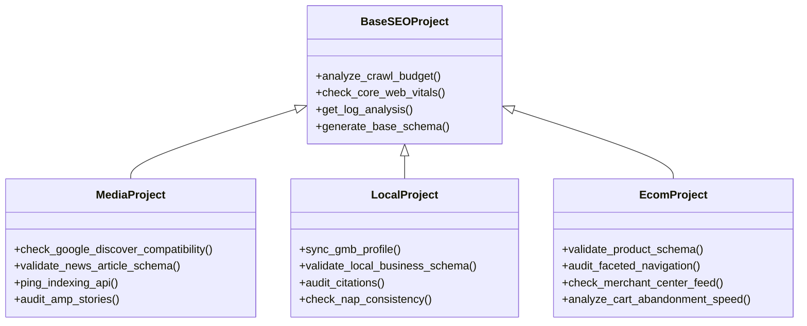

# Plan de Mejora Integral para SEO Suite Ultimate (2025)

Este documento consolida y expande las ideas de mejora generadas previamente, incorporando nuevos hallazgos tras un análisis reciente del código base. El objetivo es transformar el proyecto en una aplicación robusta, segura y mantenible.

## 1. Arquitectura y Estructura del Proyecto

### 🏗️ Reorganización del Directorio `apps/`
**Diagnóstico:** El directorio `apps/` es una estructura plana con más de 60 archivos que mezclan responsabilidades (rutas web, lógica de negocio, utilidades).
**Acción:** Reestructurar en sub-paquetes semánticos:
- `apps/web/`: Blueprints y rutas HTTP (e.g., `audit_bp.py`, `dashboard_bp.py`).
- `apps/services/`: Lógica de negocio pura y servicios (e.g., `llm_service.py`, `scraper_core.py`).
- `apps/core/`: Infraestructura base (`database.py`, `config.py`, `logger.py`).
- `apps/models/`: Definiciones de datos y esquemas.
- `apps/utils/`: Funciones auxiliares genéricas.

### 🔌 Eliminación de "Side Effects" en Importación
**Diagnóstico:** Archivos como `apps/database.py` inicializan conexiones y `apps/__init__.py` inicia hilos de monitoreo al momento de ser importados, dificultando los tests aislados.
**Acción:**
- Mover lógica de inicialización a una función `create_app()` o `init_resources()`.
- Usar el patrón "Application Factory" de Flask de forma estricta.

### 🗄️ Centralización de Datos
**Diagnóstico:** Archivos SQLite (`projects.db`) y reportes se generan dispersos en la raíz o carpetas relativas.
**Acción:** Definir un directorio `data/` centralizado para persistencia, gestionado via configuración.

## 2. Frontend y Experiencia de Usuario (UX)

### 🎨 Unificación de Frameworks CSS
**Diagnóstico:** Uso híbrido de Bootstrap 5 (CSS) y Tailwind CSS (CDN Script), causando carga doble, conflictos de estilo y dependencia online.
**Acción:**
- Estandarizar el uso de **Tailwind CSS** como framework principal.
- Eliminar progresivamente Bootstrap.
- Reemplazar el script CDN de Tailwind por un proceso de compilación (build step) que genere un archivo CSS optimizado.

### 📦 Modo "Offline" y Assets Locales
**Diagnóstico:** Dependencia crítica de CDNs para fuentes, iconos y estilos. La aplicación no funciona sin internet.
**Acción:** Descargar y servir todos los assets (fuentes, JS, CSS) desde la carpeta `static/` local.

## 3. Seguridad y Configuración

### 🔑 Gestión Segura de Configuración (.env)
**Diagnóstico:** `config.py` usa `os.environ` pero no carga variables desde un archivo, requiriendo configuración manual del entorno.
**Acción:** Integrar `python-dotenv` para cargar automáticamente variables desde un archivo `.env` local.

### 🛡️ Validación de Entradas y Protección SSRF
**Diagnóstico:** Validación dispersa y manual. Riesgos de SSRF en herramientas que procesan URLs externas.
**Acción:**
- Implementar validación de esquemas con **Pydantic** para todos los endpoints JSON.
- Aplicar la función `is_safe_url` (ya existente) de forma obligatoria en *todas* las peticiones salientes.
- Usar `werkzeug.utils.secure_filename` estrictamente para cualquier manejo de archivos.

## 4. DevOps y Mantenimiento

### 📌 Pinning de Dependencias
**Diagnóstico:** `requirements.txt` sin versiones fijas, riesgo alto de roturas por actualizaciones de librerías.
**Acción:** Generar un `requirements.txt` (o `requirements.lock`) con versiones exactas y hashes usando `pip-tools`.

### 📝 Documentación Viva (Swagger)
**Diagnóstico:** Falta de documentación de API.
**Acción:** Integrar **Flasgger** o similar para generar documentación OpenAPI/Swagger automática desde los docstrings.

## 5. Testing y Calidad (QA)

### 🧪 Estrategia de Testing "Offline"
**Diagnóstico:** Tests existentes requieren conexión a internet y claves API reales.
**Acción:**
- Mockear agresivamente todas las llamadas de red (`requests`, `playwright`) y APIs de terceros.
- Usar base de datos en memoria para tests de integración.

### 📏 Estándares y Tipado
**Diagnóstico:** Código inconsistente y falta de tipos.
**Acción:**
- Aplicar **Black** y **Isort** para formateo.
- Añadir **Type Hints** graduales y verificar con **MyPy**.

## 6. Rendimiento

### ⚡ Scraping Asíncrono
**Diagnóstico:** Cuellos de botella por uso de hilos y bloqueos en scraping síncrono.
**Acción:** Migrar scraping intensivo a **Playwright Async API** y gestionar trabajos largos con colas (Redis/RQ o similar).
# Plan de Mejora Estratégico - MediaFlow SEO Suite (2025)

Este documento consolida las iniciativas clave para transformar la aplicación actual en un sistema robusto, seguro y escalable. Las propuestas se basan en un análisis profundo del código existente y planes previos.

## 1. Victorias Rápidas (Quick Wins)
*Mejoras de alto impacto y bajo esfuerzo para estabilizar el sistema inmediatamente.*

### 🛑 Eliminar "Side Effects" en Importaciones
**Problema:** El módulo `apps/database.py` ejecuta `init_db()` automáticamente al ser importado. Esto impide importar el módulo en tests sin crear una base de datos real.
**Solución:**
- Eliminar la llamada `init_db()` del final de `apps/database.py`.
- Invocar `init_db()` explícitamente en `create_app()` dentro de `apps/__init__.py`.

### 🔒 Gestión de Secretos (.env)
**Problema:** La configuración (`config.py`) depende de variables de entorno del sistema (`os.environ`) pero no carga un archivo local, dificultando el desarrollo.
**Solución:**
- Instalar `python-dotenv`.
- Configurar `config.py` para cargar automáticamente variables desde un archivo `.env`.

### 📌 Fijar Dependencias (Pinning)
**Problema:** `requirements.txt` lista librerías sin versiones específicas (e.g., `flask`, `pandas`), lo que garantiza roturas futuras cuando se publiquen nuevas versiones incompatibles.
**Solución:**
- Crear un `requirements.in` con las dependencias directas.
- Usar `pip-compile` (de `pip-tools`) para generar un `requirements.txt` con versiones exactas y hashes SHA.

---

## 2. Salud Estructural (Arquitectura)
*Refactorización necesaria para hacer el código mantenible y testearlo.*

### 🏗️ Reorganización del Directorio `apps/`
**Problema:** El directorio `apps/` es plano y contiene más de 60 archivos mezclando controladores web (Blueprints), lógica de negocio, y utilidades de infraestructura.
**Solución:** Implementar una arquitectura por capas:
- `apps/web/`: Solo rutas y Blueprints (e.g., `seo_bp.py`, `dashboard_bp.py`).
- `apps/services/`: Lógica de negocio pura (e.g., `audit_service.py`, `scraper_service.py`).
- `apps/core/`: Infraestructura (Base de datos, Config, Logging).
- `apps/models/`: Definiciones de datos (Data Classes, Pydantic Models).

### 🔍 Inyección de Dependencias
**Problema:** Los servicios instancian sus dependencias directamente (e.g., conexiones a BD, clientes HTTP), haciendo imposible el testing unitario aislado.
**Solución:** Pasar dependencias explícitamente a las funciones o clases, permitiendo inyectar Mocks durante los tests.

---

## 3. Experiencia de Usuario (Frontend)
*Modernización de la interfaz y eliminación de deuda técnica visual.*

### 🎨 Unificación CSS (Tailwind vs Bootstrap)
**Problema:** `templates/base.html` carga tanto Bootstrap 5 (CSS) como Tailwind (CDN Script). Esto duplica el peso de la página y crea conflictos de estilos.
**Solución:**
- Estandarizar **Tailwind CSS** como único framework.
- Eliminar referencias a Bootstrap gradualmente.
- Reemplazar clases de Bootstrap (`btn-primary`, `container`) por utilidades de Tailwind.

### 📦 Modo Offline (Sin CDNs)
**Problema:** La aplicación depende de internet para cargar fuentes, iconos y estilos. Si la conexión falla, la UI se rompe.
**Solución:**
- Implementar un paso de construcción (build step) para generar el CSS final.
- Descargar fuentes y scripts JS a la carpeta `static/`.
- Servir todos los assets localmente.

---

## 4. Calidad y DevOps
*Procesos para asegurar que el código funcione y sea seguro.*

### 🛡️ Validación de Tipos y Datos
**Problema:** Validación dispersa y manual de entradas JSON.
**Solución:**
- Usar **Pydantic** para validar los cuerpos de las peticiones (Request Bodies).
- Añadir Type Hints (tipado estático) a las funciones críticas y verificar con `mypy`.

### 🧪 Estrategia de Testing Aislado
**Problema:** Los tests actuales requieren conexión a internet y tocan la base de datos real.
**Solución:**
- Usar `sqlite3.connect(':memory:')` para tests de integración rápidos.
- Mockear todas las llamadas externas (`requests`, `playwright`) usando `pytest-mock`.

### ⚡ Scraping Asíncrono
**Problema:** El scraping bloquea los hilos del servidor web.
**Solución:** Migrar tareas pesadas a **Playwright Async** y ejecutarlas en procesos de fondo (Background Workers) separados del servidor Flask principal.
# ARCHITECTURE_SCALE_ROADMAP.md

## Introducción

Este documento detalla el plan arquitectónico para transformar la aplicación actual (optimizada para SEO de Medios/Publishers en un entorno React estático) en un SaaS Multi-Tenant escalable capaz de soportar múltiples verticales (Local, Ecommerce, Internacional).

---

## Sección A: Refactorización del Backend (Patrón Strategy/Factory)

Actualmente, la lógica de negocio (tareas de auditoría, recetas de Python) está acoplada en el frontend (`constants.tsx`). Para escalar, debemos mover esto a un backend robusto (Python/Django o Node/NestJS) que sirva la lógica adecuada según el tipo de proyecto.

### 1. Desacoplamiento de Lógica

Implementaremos el **Patrón Strategy** para encapsular los algoritmos y reglas de negocio específicos de cada vertical.

#### Jerarquía de Clases Propuesta



### 2. Implementación de Factory

Una `ProjectFactory` instanciará la clase correcta basada en la configuración del proyecto al momento de la creación.

**Ejemplo (Pseudocódigo Python):**

```python
class SEOProjectFactory:
    @staticmethod
    def get_project_service(project_type: str):
        if project_type == 'MEDIA':
            return MediaProjectService()
        elif project_type == 'LOCAL':
            return LocalProjectService()
        elif project_type == 'ECOM':
            return EcomProjectService()
        else:
            raise ValueError("Tipo de proyecto desconocido")
```

### 3. Migración de `constants.tsx` a Base de Datos

Las tareas definidas actualmente en `INITIAL_MODULES` (frontend) se migrarán a una tabla `AuditTemplates`. El backend servirá estas tareas dinámicamente.

- **Media Template:** Tareas de Indexing API, NewsArticle.
- **Local Template:** Tareas de GMB, Reviews.
- **Ecom Template:** Tareas de Schema Product, Category pages.

---

## Sección B: Definición de Modelos (Base de Datos)

Se propone un esquema relacional (PostgreSQL) para manejar la multi-tenencia y la seguridad de las credenciales.

### Diagrama Entidad-Relación Simplificado

#### 1. Tenants & Users (Multi-Tenancy)

- **Organization (Tenant):** `id`, `name`, `plan_tier`, `created_at`
- **User:** `id`, `email`, `password_hash`, `organization_id` (FK), `role` (Admin, Editor, Viewer)

#### 2. Projects Core

- **Project:**
  - `id` (UUID)
  - `organization_id` (FK -> Organization)
  - `name`
  - `domain` (e.g., "marca.com")
  - `project_type` (ENUM: 'MEDIA', 'LOCAL', 'ECOM', 'INTL')
  - `status` (Active, Archived)
  - `settings` (JSONB - configuración específica del vertical)

#### 3. Google Integrations

- **GSCIntegration:**
  - `project_id` (FK -> Project)
  - `property_url` (la URL exacta en GSC, ej: "sc-domain:marca.com")
  - `refresh_token` (Encrypted - OAuth2)
  - `access_token_expiry`
  - `service_account_email` (si usamos Service Accounts para Indexing API)
  - `indexing_api_quota_usage` (Daily counter)

#### 4. Audits & Tasks

- **AuditTemplate:** `id`, `project_type`, `task_name`, `description`, `impact_level`
- **ProjectTaskState:** `project_id`, `template_id`, `status` (Pending, Done), `last_checked_at`

---

## Sección C: Flujo de la GSC API (Project Management)

Este módulo gestionará el ciclo de vida del proyecto en Google Search Console directamente desde nuestra App.

### Flujo: "Crear Proyecto -> Conectar GSC -> Asignar Permisos"

#### Pseudocódigo del Controlador de Onboarding

```javascript
/**
 * Paso 1: Crear el proyecto en nuestra DB y en GSC
 * Endpoint: POST /api/projects/onboarding
 */
async function onboardProject(user, domain, type) {
  // 1. Crear registro local
  const project = await Project.create({ domain, type, organization: user.org });

  // 2. Añadir sitio a la cuenta de servicio/app en GSC
  // API: https://developers.google.com/webmaster-tools/v1/sites/add
  await gscClient.sites.add({ siteUrl: domain });

  // 3. Obtener token de verificación
  // API: https://developers.google.com/site-verification/v1/webResource/getToken
  const verificationToken = await siteVerificationClient.webResource.getToken({
    verificationMethod: 'DNS_TXT', // O 'META'
    site: { identifier: domain, type: 'INET_DOMAIN' },
  });

  return {
    project_id: project.id,
    verification_token: verificationToken.token,
    instructions: 'Añade este registro TXT a tu DNS...',
  };
}

/**
 * Paso 2: Verificar la propiedad una vez el usuario confirma
 * Endpoint: POST /api/projects/{id}/verify
 */
async function verifyProject(projectId) {
  const project = await Project.findById(projectId);

  // 4. Intentar verificación
  // API: https://developers.google.com/site-verification/v1/webResource/insert
  try {
    await siteVerificationClient.webResource.insert({
      verificationMethod: 'DNS_TXT',
      site: { identifier: project.domain, type: 'INET_DOMAIN' },
    });

    project.status = 'VERIFIED';
    await project.save();
    return { success: true };
  } catch (e) {
    return { success: false, error: 'DNS no propagado aún.' };
  }
}

/**
 * Paso 3: Auto-Gestionar usuarios (Invitar al cliente a su propio GSC)
 * Endpoint: POST /api/projects/{id}/invite-user
 */
async function grantUserAccess(projectId, userEmail) {
  const project = await Project.findById(projectId);

  // 5. Asignar permisos en GSC
  // API: https://developers.google.com/webmaster-tools/v1/permissions/update
  // Nota: Esto permite que el usuario vea la propiedad en su interfaz nativa de Google
  await gscClient.permissions.update({
    siteUrl: project.domain,
    requestBody: {
      permissionLevel: 'siteOwner', // O 'siteFullUser'
      type: 'user',
      identity: userEmail,
    },
  });

  return { message: `Usuario ${userEmail} añadido a GSC exitosamente` };
}
```

### Consideraciones de Seguridad

1.  **Encryption:** Los `refresh_token` deben almacenarse encriptados en la base de datos (ej. AES-256).
2.  **Scopes:** Solicitar solo los scopes necesarios (`https://www.googleapis.com/auth/webmasters`, `https://www.googleapis.com/auth/siteverification`).
3.  **Rate Limiting:** Implementar colas (Redis/Celery) para las llamadas a Indexing API y GSC API para no exceder las cuotas de Google.
# Lista de Mejoras Propuestas (Roadmap Técnico - Frontend Only)

Tras un análisis exhaustivo del código, he identificado las siguientes áreas de mejora clasificadas por prioridad e impacto.

## 🏗 Arquitectura y Refactorización (Prioridad Alta)

1.  **Migración a Context API (`ClientContext` & `ProjectContext`)** [COMPLETADO]
    - **Estado:** Implementado en `ProjectContext`. `App.tsx` refactorizado.

2.  **Implementación del Patrón Strategy para Verticales** [COMPLETADO]
    - **Estado:** Implementado en `strategies/StrategyFactory.ts` y clases de estrategia.

3.  **Capa de Abstracción de Datos (Repository Pattern)** [PARCIALMENTE COMPLETADO]
    - **Estado:** `SettingsRepository` y `ClientRepository` existen.
    - **Mejora Pendiente:** Refactorizar `useGSCAuth` y otros hooks para usar `SettingsRepository` en lugar de acceder directamente a `localStorage`.

4.  **Custom Hooks para Lógica Compleja** [COMPLETADO]
    - **Estado:** `useGSCAuth` y `useGSCData` implementados.

5.  **React Query / SWR (Data Fetching)** [COMPLETADO]
    - **Estado:** Implementado en `hooks/useGSCData.ts` usando `@tanstack/react-query`.
    - **Mejora:** Extender uso a futuras integraciones de API.

6.  **Eliminación de Prop Drilling en App.tsx** [PENDIENTE - CRÍTICO]
    - **Problema:** `App.tsx` pasa props (`modules`, `clients`, etc.) manualmente a través de rutas y layouts.
    - **Solución:** Refactorizar `AppRoutes` y componentes hijos para consumir `useProject()` directamente desde el contexto, simplificando la jerarquía de componentes.

7.  **Code Splitting y Lazy Loading** [PENDIENTE - PERFORMANCE]
    - **Problema:** Todas las páginas se importan estáticamente en `App.tsx`, aumentando el tamaño del bundle inicial.
    - **Solución:** Implementar `React.lazy()` y `Suspense` para cargar rutas bajo demanda (`pages/Dashboard`, `pages/ModuleDetail`, etc.).

8.  **Estandarización de Estructura de Carpetas** [PENDIENTE]
    - **Problema:** Estructura plana en la raíz (`App.tsx`, `types.ts`, `pages/` en root).
    - **Solución:** Mover código fuente a un directorio `src/` (`src/components`, `src/pages`, `src/context`, etc.) para seguir convenciones estándar de React/Vite.

9.  **Persistencia Robusta (IndexedDB)** [PENDIENTE]
    - **Problema:** `localStorage` tiene límite de 5MB y es síncrono.
    - **Solución:** Migrar a **IndexedDB** (usando `Dexie.js`) para manejar grandes volúmenes de datos (imágenes, logs extensos) sin bloquear el hilo principal.

## 🚀 Funcionalidades Nuevas (Valor para el Usuario)

10. **Sistema de Importación/Exportación (JSON)** [COMPLETADO]
    - **Estado:** Implementado en `DataManagementPanel`.

11. **Internationalization (i18n)** [COMPLETADO]
    - **Estado:** Implementado con `react-i18next`. Textos migrados a `locales/`.

12. **Streaming de IA (Respuesta en tiempo real)** [COMPLETADO]
    - **Estado:** Soportado en `services/aiTaskService.ts` (`onUpdate` callback) y utilizado en la funcionalidad "Vitaminizar".

13. **Progressive Web App (PWA)** [PENDIENTE]
    - **Mejora:** Habilitar capacidades offline completas y botón "Instalar app".

14. **Historial de Cambios (Undo/Redo)** [PENDIENTE]
    - **Mejora:** Implementar un stack de acciones para revertir cambios accidentales en roadmaps.

15. **Modo "Zen" o Foco**
    - **Mejora:** Una vista de detalle de tarea simplificada.

## 🎨 UX/UI y Calidad de Código

16. **Strict Typing (TypeScript)**
    - **Mejora:** Definir interfaces estrictas para `Task`, `LogEntry` y eliminar todos los `any`.

17. **Error Boundaries (Límites de Error)**
    - **Estado:** Parcialmente implementado.
    - **Mejora:** Envolver componentes críticos adicionales.

18. **Feedback de Carga Mejorado (Skeletons)**
    - **Mejora:** Implementar `Skeleton` screens para cargas de datos (GSC, AI) en lugar de spinners simples.

19. **Testing Unitario (Vitest)** [PRIORIDAD MEDIA]
    - **Estado:** Infraestructura básica presente.
    - **Mejora:** Añadir tests para lógica de negocio crítica:
      - `utils/gscInsights.ts` (Algoritmos de análisis)
      - `strategies/StrategyFactory.ts`

20. **Linting y Formateo** [COMPLETADO]
    - **Estado:** Configurado (ESLint + Prettier). scripts `lint` y `format` en `package.json`.

21. **Validación de Formularios**
    - **Mejora:** Usar `zod` o validación manual robusta.

### Reportes

- **Exportación Avanzada (PDF/CSV):** Añadir opciones de exportación profesional.

## 🌟 Nuevas Propuestas (Feb 2025)

22. **Memoria del Proyecto (Contexto Global IA)** [PENDIENTE]
    - **Mejora:** Permitir definir tono de marca, audiencia y competidores en Ajustes para inyectarlos en todos los prompts de IA.

23. **Tablero Kanban Global** [PENDIENTE]
    - **Mejora:** Vista unificada de tareas arrastrables (To Do, Doing, Done) independiente de los módulos.

24. **Monitor de Content Decay** [PENDIENTE]
    - **Mejora:** Algoritmo en `useGSCData` que compare periodos para detectar URLs con pérdida significativa de tráfico.

## 🎨 Guía visual mínima (Design Layer compartida)

### Tokens de marca

Se definieron tokens globales en:

- `tailwind.config.js` (mapeo Tailwind → variables CSS)
- `src/index.css` (`:root` / `.dark`)

Variables principales disponibles:

- Colores: `--color-primary`, `--color-success`, `--color-warning`, `--color-danger`, `--color-surface`, `--color-border`, `--color-foreground`, etc.
- Radios: `--radius-sm`, `--radius-md`, `--radius-lg`
- Sombras: `--shadow-card`, `--shadow-brand`
- Tipografía: `--font-sans`
- Espaciado: `--space-18`

### Componentes semánticos (`src/components/ui/`)

- `Button` (`primary | secondary | ghost | danger`)
- `Badge` (`primary | success | warning | danger | neutral`)
- `Card`
- `Input`
- `Modal`

### Ejemplos rápidos

```tsx
<Button variant="primary">Guardar</Button>
<Button variant="danger">Eliminar</Button>

<Badge variant="success">Activo</Badge>

<Card>
  <h3 className="section-title">Bloque</h3>
  <Input placeholder="Buscar..." />
</Card>

<Modal isOpen={open} onClose={() => setOpen(false)} title="Detalle">
  Contenido del modal
</Modal>
```

### Regla de revisión obligatoria

- ✅ En páginas (`src/pages/**`) **evitar clases de color directas** (`bg-blue-*`, `text-red-*`, etc.) para nuevos desarrollos.
- ✅ Usar primero componentes semánticos (`Button`, `Badge`, `Card`, `Input`, `Modal`) y tokens (`primary`, `surface`, `border`, `foreground`).
- ✅ Si se necesita un nuevo estado visual, extender tokens/variantes en la capa UI compartida en lugar de estilizar ad-hoc en la página.
