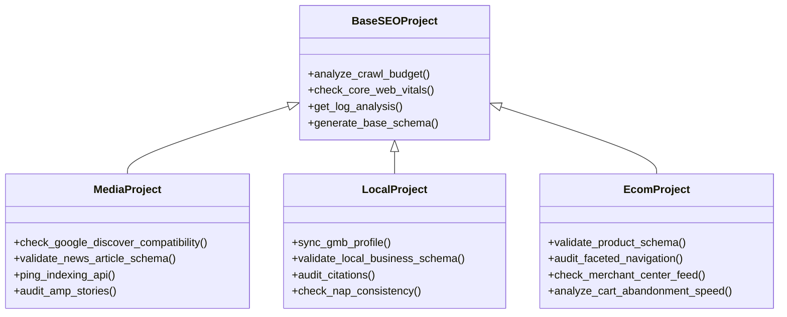

# ARCHITECTURE_SCALE_ROADMAP.md

## Introducción

Este documento detalla el plan arquitectónico para transformar la aplicación actual (optimizada para SEO de Medios/Publishers en un entorno React estático) en un SaaS Multi-Tenant escalable capaz de soportar múltiples verticales (Local, Ecommerce, Internacional).

---

## Sección A: Refactorización del Backend (Patrón Strategy/Factory)

Actualmente, la lógica de negocio (tareas de auditoría, recetas de Python) está acoplada en el frontend (`constants.tsx`). Para escalar, debemos mover esto a un backend robusto (Python/Django o Node/NestJS) que sirva la lógica adecuada según el tipo de proyecto.

### 1. Desacoplamiento de Lógica

Implementaremos el **Patrón Strategy** para encapsular los algoritmos y reglas de negocio específicos de cada vertical.

#### Jerarquía de Clases Propuesta



### 2. Implementación de Factory

Una `ProjectFactory` instanciará la clase correcta basada en la configuración del proyecto al momento de la creación.

**Ejemplo (Pseudocódigo Python):**

```python
class SEOProjectFactory:
    @staticmethod
    def get_project_service(project_type: str):
        if project_type == 'MEDIA':
            return MediaProjectService()
        elif project_type == 'LOCAL':
            return LocalProjectService()
        elif project_type == 'ECOM':
            return EcomProjectService()
        else:
            raise ValueError("Tipo de proyecto desconocido")
```

### 3. Migración de `constants.tsx` a Base de Datos

Las tareas definidas actualmente en `INITIAL_MODULES` (frontend) se migrarán a una tabla `AuditTemplates`. El backend servirá estas tareas dinámicamente.

- **Media Template:** Tareas de Indexing API, NewsArticle.
- **Local Template:** Tareas de GMB, Reviews.
- **Ecom Template:** Tareas de Schema Product, Category pages.

---

## Sección B: Definición de Modelos (Base de Datos)

Se propone un esquema relacional (PostgreSQL) para manejar la multi-tenencia y la seguridad de las credenciales.

### Diagrama Entidad-Relación Simplificado

#### 1. Tenants & Users (Multi-Tenancy)

- **Organization (Tenant):** `id`, `name`, `plan_tier`, `created_at`
- **User:** `id`, `email`, `password_hash`, `organization_id` (FK), `role` (Admin, Editor, Viewer)

#### 2. Projects Core

- **Project:**
  - `id` (UUID)
  - `organization_id` (FK -> Organization)
  - `name`
  - `domain` (e.g., "marca.com")
  - `project_type` (ENUM: 'MEDIA', 'LOCAL', 'ECOM', 'INTL')
  - `status` (Active, Archived)
  - `settings` (JSONB - configuración específica del vertical)

#### 3. Google Integrations

- **GSCIntegration:**
  - `project_id` (FK -> Project)
  - `property_url` (la URL exacta en GSC, ej: "sc-domain:marca.com")
  - `refresh_token` (Encrypted - OAuth2)
  - `access_token_expiry`
  - `service_account_email` (si usamos Service Accounts para Indexing API)
  - `indexing_api_quota_usage` (Daily counter)

#### 4. Audits & Tasks

- **AuditTemplate:** `id`, `project_type`, `task_name`, `description`, `impact_level`
- **ProjectTaskState:** `project_id`, `template_id`, `status` (Pending, Done), `last_checked_at`

---

## Sección C: Flujo de la GSC API (Project Management)

Este módulo gestionará el ciclo de vida del proyecto en Google Search Console directamente desde nuestra App.

### Flujo: "Crear Proyecto -> Conectar GSC -> Asignar Permisos"

#### Pseudocódigo del Controlador de Onboarding

```javascript
/**
 * Paso 1: Crear el proyecto en nuestra DB y en GSC
 * Endpoint: POST /api/projects/onboarding
 */
async function onboardProject(user, domain, type) {
  // 1. Crear registro local
  const project = await Project.create({ domain, type, organization: user.org });

  // 2. Añadir sitio a la cuenta de servicio/app en GSC
  // API: https://developers.google.com/webmaster-tools/v1/sites/add
  await gscClient.sites.add({ siteUrl: domain });

  // 3. Obtener token de verificación
  // API: https://developers.google.com/site-verification/v1/webResource/getToken
  const verificationToken = await siteVerificationClient.webResource.getToken({
    verificationMethod: 'DNS_TXT', // O 'META'
    site: { identifier: domain, type: 'INET_DOMAIN' },
  });

  return {
    project_id: project.id,
    verification_token: verificationToken.token,
    instructions: 'Añade este registro TXT a tu DNS...',
  };
}

/**
 * Paso 2: Verificar la propiedad una vez el usuario confirma
 * Endpoint: POST /api/projects/{id}/verify
 */
async function verifyProject(projectId) {
  const project = await Project.findById(projectId);

  // 4. Intentar verificación
  // API: https://developers.google.com/site-verification/v1/webResource/insert
  try {
    await siteVerificationClient.webResource.insert({
      verificationMethod: 'DNS_TXT',
      site: { identifier: project.domain, type: 'INET_DOMAIN' },
    });

    project.status = 'VERIFIED';
    await project.save();
    return { success: true };
  } catch (e) {
    return { success: false, error: 'DNS no propagado aún.' };
  }
}

/**
 * Paso 3: Auto-Gestionar usuarios (Invitar al cliente a su propio GSC)
 * Endpoint: POST /api/projects/{id}/invite-user
 */
async function grantUserAccess(projectId, userEmail) {
  const project = await Project.findById(projectId);

  // 5. Asignar permisos en GSC
  // API: https://developers.google.com/webmaster-tools/v1/permissions/update
  // Nota: Esto permite que el usuario vea la propiedad en su interfaz nativa de Google
  await gscClient.permissions.update({
    siteUrl: project.domain,
    requestBody: {
      permissionLevel: 'siteOwner', // O 'siteFullUser'
      type: 'user',
      identity: userEmail,
    },
  });

  return { message: `Usuario ${userEmail} añadido a GSC exitosamente` };
}
```

### Consideraciones de Seguridad

1.  **Encryption:** Los `refresh_token` deben almacenarse encriptados en la base de datos (ej. AES-256).
2.  **Scopes:** Solicitar solo los scopes necesarios (`https://www.googleapis.com/auth/webmasters`, `https://www.googleapis.com/auth/siteverification`).
3.  **Rate Limiting:** Implementar colas (Redis/Celery) para las llamadas a Indexing API y GSC API para no exceder las cuotas de Google.
